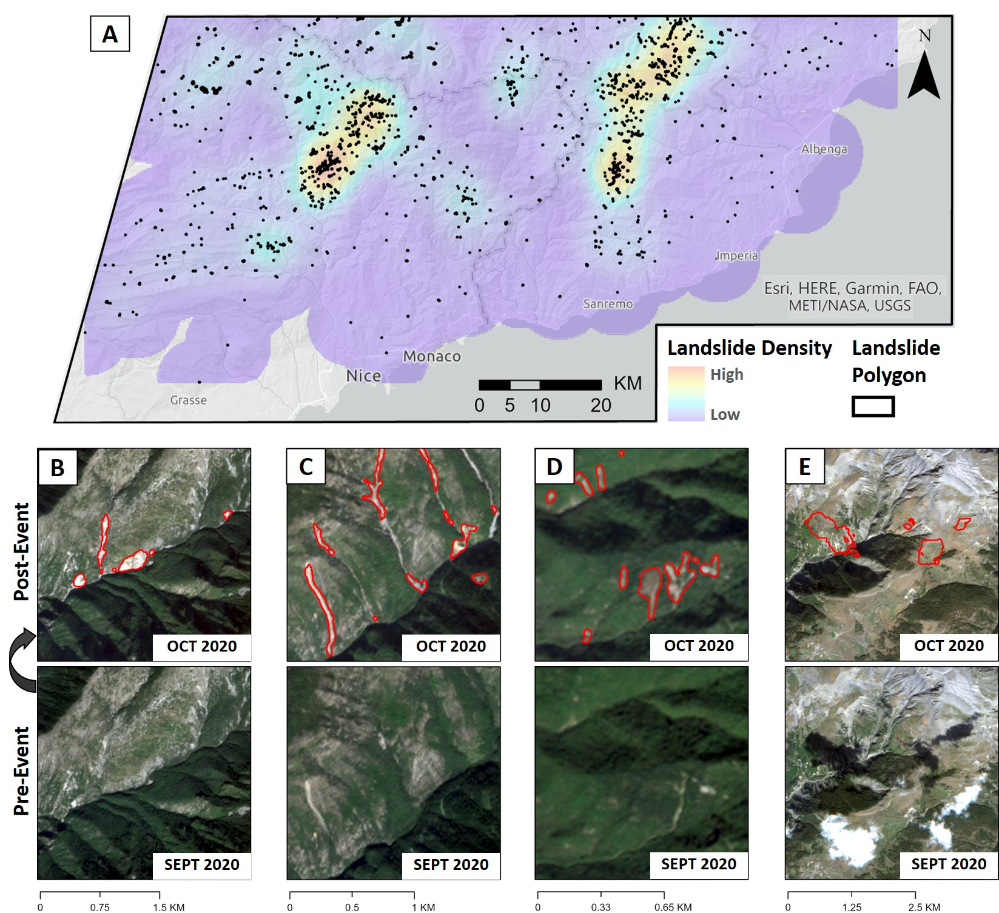

# Introduction

This repository is adapted from the [work](https://github.com/nprksh/landslide-mapping-with-cnn) of Nikhil Prakash, Andrea Manconi and Simon Loew. The perpose of this repository is to provided an AI routine for detecting landslide regions using satellite images, for participating the 2021 NASA Space Apps challenge. Please see this [repository](https://github.com/ChenyuZhang16/nasa-space-app-sentry) about how this routine is used for the challenge.

# Example

Please see [this jupyter notebook](LS_mapping.ipynb) for example usage.

# Installation

## Requirements

- numpy
- matplotlib
- tqdm
- tensorflow
- osgeo
- Open CV

## How to install

Using `pip`:

``` bash
pip install git+https://github.com/ChenyuZhang16/landslide-mapping-with-cnn.git
```

From source:
``` bash
pip install --editable .
```

# Bug report

Because this is a forked repository, please report bugs/issues to this [repository](https://github.com/ChenyuZhang16/nasa-space-app-sentry/issues).

## = = = = = = = = = = = = = = = = = = = = = = = = = = = = = =

## Below are the readme from the original repository

## = = = = = = = = = = = = = = = = = = = = = = = = = = = = = =

# A new strategy to map landslides with a generalized convolutional neural network
Code repository for https://www.nature.com/articles/s41598-021-89015-8

[](https://zenodo.org/badge/latestdoi/320126384)

**NOTE:** The file "M_ALL_006.hdf5" is the trained TensorFlow model.

A typical machine learning workflow involves creating a small inventory manually to train a supervised model, which is further used to map landslides in the surrounding areas of interest. This saves a lot of time and effort, however, it is still not suitable for a fully automated rapid mapping scenario as human intervention is required for creating the initial training inventory.
 
This repository shares a generalized deep-learning model which can be used to map landslides triggred by large earthquakes or extreme rainfall events. It can be used on medium resolution EO data (resolution: 5 - 10 meters, like Sentinel-2, Rapid-Eye, etc). It can be used directly without training for a specific event / georgaphic location.

-----------------------------------------------------


Figure: _Pre-processing workflow adopted for training of CNN. (A) Systematic tiling of input images with 50% overlap. In this study , a tile size of 224×224 was used as an input to the CNN. The tile size in display is for representation purposes and does not scale to the actual base resolution used in training the CNN. (B) Steps involved in the data-augmentation of input images with their corresponding landslide mask._

-----------------------------------------------------


Figure: _An overview of proposed U-Net architecture with residual blocks and deep-supervision. The complete description of all the layers in the network is available in Supplementary-Figure Folder._

-----------------------------------------------------
-----------------------------------------------------
# Upcoming in IGARSS 2021 Conference
# Mapping landslides caused by Storm Alex, October - 2020 (French-Italian Alps) 



Result of landslide mapping. (A) The density map showing the distribution of induced landslides identified by the generalized CNN. (B) - (E) Multiple views from the study area showing changes observed in Sentinel-2 images from before and after the triggering event. The landslides identified by the CNN has been marked as red polygons in the post-event images. Figure (E) is an example of false-positive detection due to cloud shadow, which was not identified by the Fmask algorithm.

